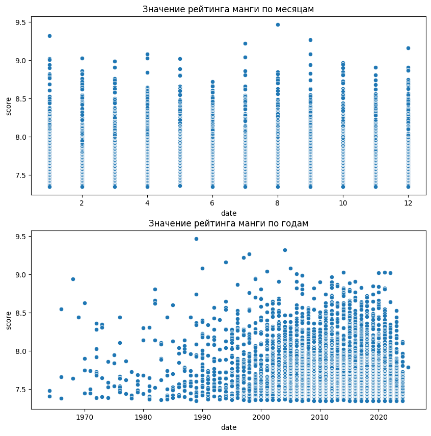
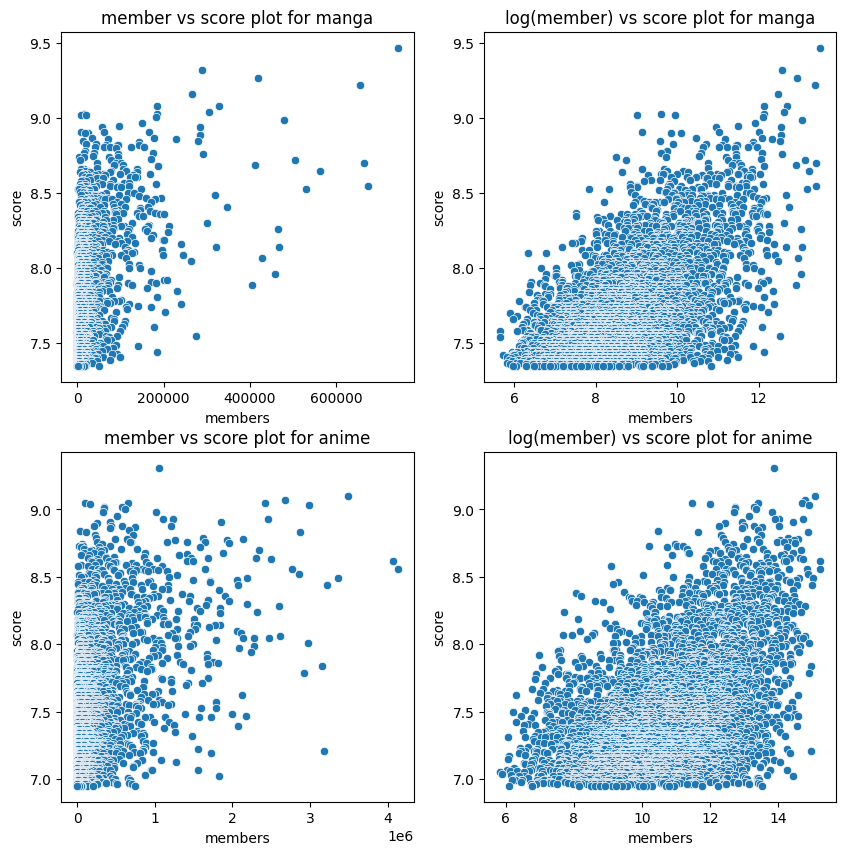
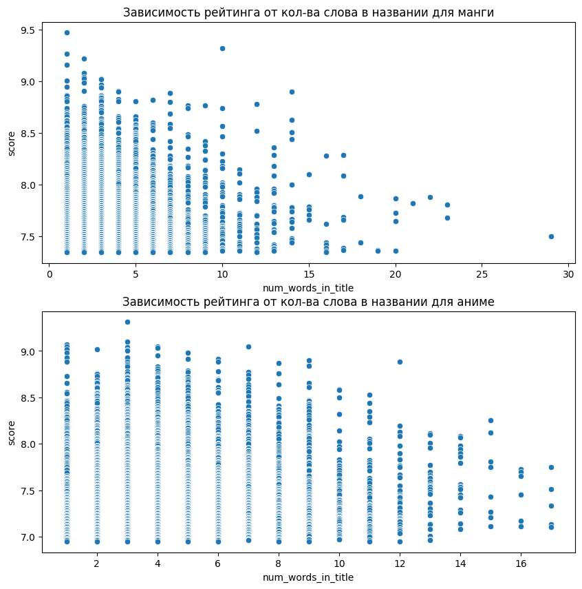
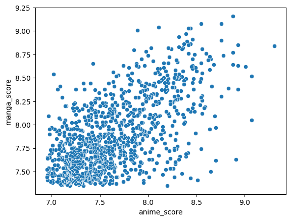

**Описание исследования**

Целью данной работы является провести сравнительный анализ аниме и манг, с помощью данных, полученных через Jikan API (API платформы MyAnimeList). Для достижения данной цели будем выявлять закономерности между популярностью, рейтингом, жанрами и другими характеристиками аниме и их манга-адаптаций (и наоборот).


# Импорты библиотек


```python
import requests
import pandas as pd
import numpy as np
from tqdm.notebook import tqdm
import time

import matplotlib.pyplot as plt
import seaborn as sns
import statsmodels.api as sm

import requests
from PIL import Image
from io import BytesIO
```

# Получение данных по API


```python
data = []
pbar = tqdm(range(1, 201), desc="Loading")

for page in pbar:
    url = f"https://api.jikan.moe/v4/top/anime?page={page}"
    response = requests.get(url)
    if response.status_code == 200:
        for anime in response.json()['data']:
            data.append({
                'title': anime['title'],
                'score': anime['score'],
                'genres': ', '.join([g['name'] for g in anime['genres']]),
                'episodes': anime['episodes'],
                'members': anime['members']
            })
    else:
        print(f"Ошибка на странице {page} | Error code: {response.status_code}")
    time.sleep(0.4)

df_anime = pd.DataFrame(data)
```


    Loading:   0%|          | 0/200 [00:00<?, ?it/s]


```python
def convert_date(x):
  if any(x[el] is None for el in ("day", "month", "year")):
    return np.nan

  return f"{x['day']}-{x['month']}-{x['year']}"


data = []

pbar = tqdm(range(1, 201), desc="Loading")

for page in pbar:
    url = f"https://api.jikan.moe/v4/top/manga?page={page}"
    response = requests.get(url)
    if response.status_code == 200:
        for manga in response.json()['data']:
            data.append({
                'title': manga['title'],
                'score': manga['score'],
                'genres': ', '.join([g['name'] for g in manga['genres']]),
                'date': convert_date(manga["published"]["prop"]["from"]),
                'members': manga['members']
            })
    else:
        print(f"Ошибка на странице {page} | Error code: {response.status_code}")
    time.sleep(0.4)

df_manga = pd.DataFrame(data)
```


    Loading:   0%|          | 0/200 [00:00<?, ?it/s]


```python
df_anime
```


  <div id="df-27b1add7-668d-4198-b152-63bb9e1db098" class="colab-df-container">
    <div>
<style scoped>
    .dataframe tbody tr th:only-of-type {
        vertical-align: middle;
    }

    .dataframe tbody tr th {
        vertical-align: top;
    }

    .dataframe thead th {
        text-align: right;
    }
</style>
<table border="1" class="dataframe">
  <thead>
    <tr style="text-align: right;">
      <th></th>
      <th>title</th>
      <th>score</th>
      <th>genres</th>
      <th>episodes</th>
      <th>members</th>
    </tr>
  </thead>
  <tbody>
    <tr>
      <th>0</th>
      <td>Sousou no Frieren</td>
      <td>9.31</td>
      <td>Adventure, Drama, Fantasy</td>
      <td>28.0</td>
      <td>1058537</td>
    </tr>
    <tr>
      <th>1</th>
      <td>Fullmetal Alchemist: Brotherhood</td>
      <td>9.10</td>
      <td>Action, Adventure, Drama, Fantasy</td>
      <td>64.0</td>
      <td>3493507</td>
    </tr>
    <tr>
      <th>2</th>
      <td>Steins;Gate</td>
      <td>9.07</td>
      <td>Drama, Sci-Fi, Suspense</td>
      <td>24.0</td>
      <td>2676066</td>
    </tr>
    <tr>
      <th>3</th>
      <td>One Piece Fan Letter</td>
      <td>9.05</td>
      <td>Action, Adventure, Fantasy</td>
      <td>1.0</td>
      <td>96551</td>
    </tr>
    <tr>
      <th>4</th>
      <td>Shingeki no Kyojin Season 3 Part 2</td>
      <td>9.05</td>
      <td>Action, Drama, Suspense</td>
      <td>10.0</td>
      <td>2418147</td>
    </tr>
    <tr>
      <th>...</th>
      <td>...</td>
      <td>...</td>
      <td>...</td>
      <td>...</td>
      <td>...</td>
    </tr>
    <tr>
      <th>4995</th>
      <td>Kuutei Dragons</td>
      <td>6.95</td>
      <td>Adventure, Fantasy</td>
      <td>12.0</td>
      <td>49112</td>
    </tr>
    <tr>
      <th>4996</th>
      <td>Strike the Blood II</td>
      <td>6.95</td>
      <td>Action, Fantasy, Ecchi</td>
      <td>8.0</td>
      <td>203506</td>
    </tr>
    <tr>
      <th>4997</th>
      <td>Gunslinger Girl: Il Teatrino OVA</td>
      <td>6.95</td>
      <td>Action, Drama, Sci-Fi</td>
      <td>2.0</td>
      <td>24659</td>
    </tr>
    <tr>
      <th>4998</th>
      <td>Youjo Senki Movie: Manner Eizou</td>
      <td>6.95</td>
      <td>Comedy</td>
      <td>1.0</td>
      <td>22602</td>
    </tr>
    <tr>
      <th>4999</th>
      <td>Kirameki Inokori Daisensou</td>
      <td>6.95</td>
      <td></td>
      <td>1.0</td>
      <td>873</td>
    </tr>
  </tbody>
</table>
<p>5000 rows × 5 columns</p>
</div>
    <div class="colab-df-buttons">

  <div class="colab-df-container">
    <button class="colab-df-convert" onclick="convertToInteractive('df-27b1add7-668d-4198-b152-63bb9e1db098')"
            title="Convert this dataframe to an interactive table."
            style="display:none;">

  <svg xmlns="http://www.w3.org/2000/svg" height="24px" viewBox="0 -960 960 960">
    <path d="M120-120v-720h720v720H120Zm60-500h600v-160H180v160Zm220 220h160v-160H400v160Zm0 220h160v-160H400v160ZM180-400h160v-160H180v160Zm440 0h160v-160H620v160ZM180-180h160v-160H180v160Zm440 0h160v-160H620v160Z"/>
  </svg>
    </button>

  <style>
    .colab-df-container {
      display:flex;
      gap: 12px;
    }

    .colab-df-convert {
      background-color: #E8F0FE;
      border: none;
      border-radius: 50%;
      cursor: pointer;
      display: none;
      fill: #1967D2;
      height: 32px;
      padding: 0 0 0 0;
      width: 32px;
    }

    .colab-df-convert:hover {
      background-color: #E2EBFA;
      box-shadow: 0px 1px 2px rgba(60, 64, 67, 0.3), 0px 1px 3px 1px rgba(60, 64, 67, 0.15);
      fill: #174EA6;
    }

    .colab-df-buttons div {
      margin-bottom: 4px;
    }

    [theme=dark] .colab-df-convert {
      background-color: #3B4455;
      fill: #D2E3FC;
    }

    [theme=dark] .colab-df-convert:hover {
      background-color: #434B5C;
      box-shadow: 0px 1px 3px 1px rgba(0, 0, 0, 0.15);
      filter: drop-shadow(0px 1px 2px rgba(0, 0, 0, 0.3));
      fill: #FFFFFF;
    }
  </style>

    <script>
      const buttonEl =
        document.querySelector('#df-27b1add7-668d-4198-b152-63bb9e1db098 button.colab-df-convert');
      buttonEl.style.display =
        google.colab.kernel.accessAllowed ? 'block' : 'none';

      async function convertToInteractive(key) {
        const element = document.querySelector('#df-27b1add7-668d-4198-b152-63bb9e1db098');
        const dataTable =
          await google.colab.kernel.invokeFunction('convertToInteractive',
                                                    [key], {});
        if (!dataTable) return;

        const docLinkHtml = 'Like what you see? Visit the ' +
          '<a target="_blank" href=https://colab.research.google.com/notebooks/data_table.ipynb>data table notebook</a>'
          + ' to learn more about interactive tables.';
        element.innerHTML = '';
        dataTable['output_type'] = 'display_data';
        await google.colab.output.renderOutput(dataTable, element);
        const docLink = document.createElement('div');
        docLink.innerHTML = docLinkHtml;
        element.appendChild(docLink);
      }
    </script>
  </div>


<div id="df-4af5800e-3a02-4b35-b88e-51e9d7bd049f">
  <button class="colab-df-quickchart" onclick="quickchart('df-4af5800e-3a02-4b35-b88e-51e9d7bd049f')"
            title="Suggest charts"
            style="display:none;">

<svg xmlns="http://www.w3.org/2000/svg" height="24px"viewBox="0 0 24 24"
     width="24px">
    <g>
        <path d="M19 3H5c-1.1 0-2 .9-2 2v14c0 1.1.9 2 2 2h14c1.1 0 2-.9 2-2V5c0-1.1-.9-2-2-2zM9 17H7v-7h2v7zm4 0h-2V7h2v10zm4 0h-2v-4h2v4z"/>
    </g>
</svg>
  </button>

<style>
  .colab-df-quickchart {
      --bg-color: #E8F0FE;
      --fill-color: #1967D2;
      --hover-bg-color: #E2EBFA;
      --hover-fill-color: #174EA6;
      --disabled-fill-color: #AAA;
      --disabled-bg-color: #DDD;
  }

  [theme=dark] .colab-df-quickchart {
      --bg-color: #3B4455;
      --fill-color: #D2E3FC;
      --hover-bg-color: #434B5C;
      --hover-fill-color: #FFFFFF;
      --disabled-bg-color: #3B4455;
      --disabled-fill-color: #666;
  }

  .colab-df-quickchart {
    background-color: var(--bg-color);
    border: none;
    border-radius: 50%;
    cursor: pointer;
    display: none;
    fill: var(--fill-color);
    height: 32px;
    padding: 0;
    width: 32px;
  }

  .colab-df-quickchart:hover {
    background-color: var(--hover-bg-color);
    box-shadow: 0 1px 2px rgba(60, 64, 67, 0.3), 0 1px 3px 1px rgba(60, 64, 67, 0.15);
    fill: var(--button-hover-fill-color);
  }

  .colab-df-quickchart-complete:disabled,
  .colab-df-quickchart-complete:disabled:hover {
    background-color: var(--disabled-bg-color);
    fill: var(--disabled-fill-color);
    box-shadow: none;
  }

  .colab-df-spinner {
    border: 2px solid var(--fill-color);
    border-color: transparent;
    border-bottom-color: var(--fill-color);
    animation:
      spin 1s steps(1) infinite;
  }

  @keyframes spin {
    0% {
      border-color: transparent;
      border-bottom-color: var(--fill-color);
      border-left-color: var(--fill-color);
    }
    20% {
      border-color: transparent;
      border-left-color: var(--fill-color);
      border-top-color: var(--fill-color);
    }
    30% {
      border-color: transparent;
      border-left-color: var(--fill-color);
      border-top-color: var(--fill-color);
      border-right-color: var(--fill-color);
    }
    40% {
      border-color: transparent;
      border-right-color: var(--fill-color);
      border-top-color: var(--fill-color);
    }
    60% {
      border-color: transparent;
      border-right-color: var(--fill-color);
    }
    80% {
      border-color: transparent;
      border-right-color: var(--fill-color);
      border-bottom-color: var(--fill-color);
    }
    90% {
      border-color: transparent;
      border-bottom-color: var(--fill-color);
    }
  }
</style>

  <script>
    async function quickchart(key) {
      const quickchartButtonEl =
        document.querySelector('#' + key + ' button');
      quickchartButtonEl.disabled = true;  // To prevent multiple clicks.
      quickchartButtonEl.classList.add('colab-df-spinner');
      try {
        const charts = await google.colab.kernel.invokeFunction(
            'suggestCharts', [key], {});
      } catch (error) {
        console.error('Error during call to suggestCharts:', error);
      }
      quickchartButtonEl.classList.remove('colab-df-spinner');
      quickchartButtonEl.classList.add('colab-df-quickchart-complete');
    }
    (() => {
      let quickchartButtonEl =
        document.querySelector('#df-4af5800e-3a02-4b35-b88e-51e9d7bd049f button');
      quickchartButtonEl.style.display =
        google.colab.kernel.accessAllowed ? 'block' : 'none';
    })();
  </script>
</div>
    </div>
  </div>


```python
df_manga
```


  <div id="df-606d700a-aabc-43df-83a3-4af5644b5421" class="colab-df-container">
    <div>
<style scoped>
    .dataframe tbody tr th:only-of-type {
        vertical-align: middle;
    }

    .dataframe tbody tr th {
        vertical-align: top;
    }

    .dataframe thead th {
        text-align: right;
    }
</style>
<table border="1" class="dataframe">
  <thead>
    <tr style="text-align: right;">
      <th></th>
      <th>title</th>
      <th>score</th>
      <th>genres</th>
      <th>date</th>
      <th>members</th>
    </tr>
  </thead>
  <tbody>
    <tr>
      <th>0</th>
      <td>Berserk</td>
      <td>9.47</td>
      <td>Action, Adventure, Award Winning, Drama, Fanta...</td>
      <td>25-8-1989</td>
      <td>741864</td>
    </tr>
    <tr>
      <th>1</th>
      <td>JoJo no Kimyou na Bouken Part 7: Steel Ball Run</td>
      <td>9.32</td>
      <td>Action, Adventure, Mystery, Supernatural</td>
      <td>19-1-2004</td>
      <td>288051</td>
    </tr>
    <tr>
      <th>2</th>
      <td>Vagabond</td>
      <td>9.27</td>
      <td>Action, Adventure, Award Winning</td>
      <td>3-9-1998</td>
      <td>417787</td>
    </tr>
    <tr>
      <th>3</th>
      <td>One Piece</td>
      <td>9.22</td>
      <td>Action, Adventure, Fantasy</td>
      <td>22-7-1997</td>
      <td>654732</td>
    </tr>
    <tr>
      <th>4</th>
      <td>Monster</td>
      <td>9.16</td>
      <td>Award Winning, Drama, Mystery</td>
      <td>5-12-1994</td>
      <td>264953</td>
    </tr>
    <tr>
      <th>...</th>
      <td>...</td>
      <td>...</td>
      <td>...</td>
      <td>...</td>
      <td>...</td>
    </tr>
    <tr>
      <th>4995</th>
      <td>Kaze no Sylphid</td>
      <td>7.35</td>
      <td>Drama, Sports</td>
      <td>13-9-1989</td>
      <td>656</td>
    </tr>
    <tr>
      <th>4996</th>
      <td>Sagashimono</td>
      <td>7.35</td>
      <td>Drama, Romance</td>
      <td>1-1-2009</td>
      <td>2059</td>
    </tr>
    <tr>
      <th>4997</th>
      <td>Boys on the Run</td>
      <td>7.35</td>
      <td>Comedy, Drama, Romance, Sports</td>
      <td>1-1-2005</td>
      <td>9554</td>
    </tr>
    <tr>
      <th>4998</th>
      <td>Love♥Zipper</td>
      <td>7.35</td>
      <td>Romance</td>
      <td>1-1-2010</td>
      <td>3593</td>
    </tr>
    <tr>
      <th>4999</th>
      <td>Hanasaki Kanon</td>
      <td>7.35</td>
      <td>Drama</td>
      <td>8-10-2005</td>
      <td>971</td>
    </tr>
  </tbody>
</table>
<p>5000 rows × 5 columns</p>
</div>
    <div class="colab-df-buttons">

  <div class="colab-df-container">
    <button class="colab-df-convert" onclick="convertToInteractive('df-606d700a-aabc-43df-83a3-4af5644b5421')"
            title="Convert this dataframe to an interactive table."
            style="display:none;">

  <svg xmlns="http://www.w3.org/2000/svg" height="24px" viewBox="0 -960 960 960">
    <path d="M120-120v-720h720v720H120Zm60-500h600v-160H180v160Zm220 220h160v-160H400v160Zm0 220h160v-160H400v160ZM180-400h160v-160H180v160Zm440 0h160v-160H620v160ZM180-180h160v-160H180v160Zm440 0h160v-160H620v160Z"/>
  </svg>
    </button>

  <style>
    .colab-df-container {
      display:flex;
      gap: 12px;
    }

    .colab-df-convert {
      background-color: #E8F0FE;
      border: none;
      border-radius: 50%;
      cursor: pointer;
      display: none;
      fill: #1967D2;
      height: 32px;
      padding: 0 0 0 0;
      width: 32px;
    }

    .colab-df-convert:hover {
      background-color: #E2EBFA;
      box-shadow: 0px 1px 2px rgba(60, 64, 67, 0.3), 0px 1px 3px 1px rgba(60, 64, 67, 0.15);
      fill: #174EA6;
    }

    .colab-df-buttons div {
      margin-bottom: 4px;
    }

    [theme=dark] .colab-df-convert {
      background-color: #3B4455;
      fill: #D2E3FC;
    }

    [theme=dark] .colab-df-convert:hover {
      background-color: #434B5C;
      box-shadow: 0px 1px 3px 1px rgba(0, 0, 0, 0.15);
      filter: drop-shadow(0px 1px 2px rgba(0, 0, 0, 0.3));
      fill: #FFFFFF;
    }
  </style>

    <script>
      const buttonEl =
        document.querySelector('#df-606d700a-aabc-43df-83a3-4af5644b5421 button.colab-df-convert');
      buttonEl.style.display =
        google.colab.kernel.accessAllowed ? 'block' : 'none';

      async function convertToInteractive(key) {
        const element = document.querySelector('#df-606d700a-aabc-43df-83a3-4af5644b5421');
        const dataTable =
          await google.colab.kernel.invokeFunction('convertToInteractive',
                                                    [key], {});
        if (!dataTable) return;

        const docLinkHtml = 'Like what you see? Visit the ' +
          '<a target="_blank" href=https://colab.research.google.com/notebooks/data_table.ipynb>data table notebook</a>'
          + ' to learn more about interactive tables.';
        element.innerHTML = '';
        dataTable['output_type'] = 'display_data';
        await google.colab.output.renderOutput(dataTable, element);
        const docLink = document.createElement('div');
        docLink.innerHTML = docLinkHtml;
        element.appendChild(docLink);
      }
    </script>
  </div>


<div id="df-b4286cd7-0bdf-4f82-9741-07504c92d0ad">
  <button class="colab-df-quickchart" onclick="quickchart('df-b4286cd7-0bdf-4f82-9741-07504c92d0ad')"
            title="Suggest charts"
            style="display:none;">

<svg xmlns="http://www.w3.org/2000/svg" height="24px"viewBox="0 0 24 24"
     width="24px">
    <g>
        <path d="M19 3H5c-1.1 0-2 .9-2 2v14c0 1.1.9 2 2 2h14c1.1 0 2-.9 2-2V5c0-1.1-.9-2-2-2zM9 17H7v-7h2v7zm4 0h-2V7h2v10zm4 0h-2v-4h2v4z"/>
    </g>
</svg>
  </button>

<style>
  .colab-df-quickchart {
      --bg-color: #E8F0FE;
      --fill-color: #1967D2;
      --hover-bg-color: #E2EBFA;
      --hover-fill-color: #174EA6;
      --disabled-fill-color: #AAA;
      --disabled-bg-color: #DDD;
  }

  [theme=dark] .colab-df-quickchart {
      --bg-color: #3B4455;
      --fill-color: #D2E3FC;
      --hover-bg-color: #434B5C;
      --hover-fill-color: #FFFFFF;
      --disabled-bg-color: #3B4455;
      --disabled-fill-color: #666;
  }

  .colab-df-quickchart {
    background-color: var(--bg-color);
    border: none;
    border-radius: 50%;
    cursor: pointer;
    display: none;
    fill: var(--fill-color);
    height: 32px;
    padding: 0;
    width: 32px;
  }

  .colab-df-quickchart:hover {
    background-color: var(--hover-bg-color);
    box-shadow: 0 1px 2px rgba(60, 64, 67, 0.3), 0 1px 3px 1px rgba(60, 64, 67, 0.15);
    fill: var(--button-hover-fill-color);
  }

  .colab-df-quickchart-complete:disabled,
  .colab-df-quickchart-complete:disabled:hover {
    background-color: var(--disabled-bg-color);
    fill: var(--disabled-fill-color);
    box-shadow: none;
  }

  .colab-df-spinner {
    border: 2px solid var(--fill-color);
    border-color: transparent;
    border-bottom-color: var(--fill-color);
    animation:
      spin 1s steps(1) infinite;
  }

  @keyframes spin {
    0% {
      border-color: transparent;
      border-bottom-color: var(--fill-color);
      border-left-color: var(--fill-color);
    }
    20% {
      border-color: transparent;
      border-left-color: var(--fill-color);
      border-top-color: var(--fill-color);
    }
    30% {
      border-color: transparent;
      border-left-color: var(--fill-color);
      border-top-color: var(--fill-color);
      border-right-color: var(--fill-color);
    }
    40% {
      border-color: transparent;
      border-right-color: var(--fill-color);
      border-top-color: var(--fill-color);
    }
    60% {
      border-color: transparent;
      border-right-color: var(--fill-color);
    }
    80% {
      border-color: transparent;
      border-right-color: var(--fill-color);
      border-bottom-color: var(--fill-color);
    }
    90% {
      border-color: transparent;
      border-bottom-color: var(--fill-color);
    }
  }
</style>

  <script>
    async function quickchart(key) {
      const quickchartButtonEl =
        document.querySelector('#' + key + ' button');
      quickchartButtonEl.disabled = true;  // To prevent multiple clicks.
      quickchartButtonEl.classList.add('colab-df-spinner');
      try {
        const charts = await google.colab.kernel.invokeFunction(
            'suggestCharts', [key], {});
      } catch (error) {
        console.error('Error during call to suggestCharts:', error);
      }
      quickchartButtonEl.classList.remove('colab-df-spinner');
      quickchartButtonEl.classList.add('colab-df-quickchart-complete');
    }
    (() => {
      let quickchartButtonEl =
        document.querySelector('#df-b4286cd7-0bdf-4f82-9741-07504c92d0ad button');
      quickchartButtonEl.style.display =
        google.colab.kernel.accessAllowed ? 'block' : 'none';
    })();
  </script>
</div>
    </div>
  </div>


# Обрабатываем данные и создаем новые фичи

## Проверка на NaN

Проверим данные на наличие NaN значений


```python
df_anime.isna().sum()
```


<div>
<style scoped>
    .dataframe tbody tr th:only-of-type {
        vertical-align: middle;
    }

    .dataframe tbody tr th {
        vertical-align: top;
    }

    .dataframe thead th {
        text-align: right;
    }
</style>
<table border="1" class="dataframe">
  <thead>
    <tr style="text-align: right;">
      <th></th>
      <th>0</th>
    </tr>
  </thead>
  <tbody>
    <tr>
      <th>title</th>
      <td>0</td>
    </tr>
    <tr>
      <th>score</th>
      <td>0</td>
    </tr>
    <tr>
      <th>genres</th>
      <td>0</td>
    </tr>
    <tr>
      <th>episodes</th>
      <td>35</td>
    </tr>
    <tr>
      <th>members</th>
      <td>0</td>
    </tr>
  </tbody>
</table>
</div><br><label><b>dtype:</b> int64</label>


Нам нужно как то обработать NaN в ```episodes```. Так как их очень мало: $\frac{35}{5000}$ мы можем просто вырезать все самплы где ```episodes``` равно NaN


```python
df_anime = df_anime.dropna(axis=0).reset_index(drop=True)
```


```python
df_manga.isna().sum()
```


<div>
<style scoped>
    .dataframe tbody tr th:only-of-type {
        vertical-align: middle;
    }

    .dataframe tbody tr th {
        vertical-align: top;
    }

    .dataframe thead th {
        text-align: right;
    }
</style>
<table border="1" class="dataframe">
  <thead>
    <tr style="text-align: right;">
      <th></th>
      <th>0</th>
    </tr>
  </thead>
  <tbody>
    <tr>
      <th>title</th>
      <td>0</td>
    </tr>
    <tr>
      <th>score</th>
      <td>0</td>
    </tr>
    <tr>
      <th>genres</th>
      <td>0</td>
    </tr>
    <tr>
      <th>date</th>
      <td>19</td>
    </tr>
    <tr>
      <th>members</th>
      <td>0</td>
    </tr>
  </tbody>
</table>
</div><br><label><b>dtype:</b> int64</label>


В фиче ```data``` в DataFrame ```df_manga``` также не так много NaN удалим самплы с ними и продолжим работу


```python
df_manga = df_manga.dropna(axis=0).reset_index(drop=True)
```

## Обработка данных


```python
# Новые фичи
df_anime["num_words_in_title"] = df_anime["title"].str.split().apply(lambda x: len(x))
df_manga["num_words_in_title"] = df_manga["title"].str.split().apply(lambda x: len(x))

# Обработка данных
df_anime["genres"] = df_anime["genres"].str.split(", ")
df_manga["genres"] = df_manga["genres"].str.split(", ")


```

# Работа с данными

Найдем все уникальные жанры для манги и аниме


```python
uniq_anime_genres = df_anime["genres"].explode().unique()
uniq_manga_genres = df_manga["genres"].explode().unique()

uniq_anime_genres = uniq_anime_genres[uniq_anime_genres != ""]
uniq_manga_genres = uniq_manga_genres[uniq_manga_genres != ""]

uniq_anime_genres = np.sort(uniq_anime_genres)
uniq_manga_genres = np.sort(uniq_manga_genres)

df_manga["date"] = pd.to_datetime(df_manga['date'], format='%d-%m-%Y')
```


```python
uniq_anime_genres
```


    array(['Action', 'Adventure', 'Avant Garde', 'Award Winning', 'Boys Love',
           'Comedy', 'Drama', 'Ecchi', 'Erotica', 'Fantasy', 'Girls Love',
           'Gourmet', 'Hentai', 'Horror', 'Mystery', 'Romance', 'Sci-Fi',
           'Slice of Life', 'Sports', 'Supernatural', 'Suspense'],
          dtype=object)


```python
uniq_manga_genres
```


    array(['Action', 'Adventure', 'Avant Garde', 'Award Winning', 'Boys Love',
           'Comedy', 'Drama', 'Ecchi', 'Erotica', 'Fantasy', 'Girls Love',
           'Gourmet', 'Hentai', 'Horror', 'Mystery', 'Romance', 'Sci-Fi',
           'Slice of Life', 'Sports', 'Supernatural', 'Suspense'],
          dtype=object)


```python
results_anime = {}
results_manga = {}


for el in uniq_anime_genres:
    results_anime[el] = df_anime[df_anime["genres"].apply(lambda x: el in x)]["score"].mean()


for el in uniq_manga_genres:
    results_manga[el] = df_manga[df_manga["genres"].apply(lambda x: el in x)]["score"].mean()
```


```python
fig, ax = plt.subplots(2, figsize=(15, 15))

sns.barplot(x=results_anime.values(), y=results_anime.keys(), ax=ax[0], orient="h")
ax[0].set_title("Средний рейтинг жанров аниме")
sns.barplot(x=results_manga.values(), y=results_manga.keys(), ax=ax[1], orient="h")
ax[1].set_title("Средний рейтинг жанров манги");
```


    

    


Как мы ввдим средние очень схожи в обоих датасетах, это может быть связано с тем, что каждый самл связан сразу с несколькими категориями

Провеорим на распредление рейтингов манги с учетом года или месяца ее выхода


```python
fig, ax = plt.subplots(2, figsize=(10, 10))

sns.scatterplot(x=df_manga["date"].dt.month, y=df_manga["score"], ax=ax[0])
ax[0].set_title("Значение рейтинга манги по месяцам");

sns.scatterplot(x=df_manga["date"].dt.year, y=df_manga["score"], ax=ax[1])
ax[1].set_title("Значение рейтинга манги по годам");
```


    

    


Из графика "значение рейтинга манги по месяцам" можно сказать, что нет явной сезонности у данных параметров. Из графика "значение рейтинга манги по годам" можем заметить, что до 2000 года в данных представлено меньше произведений, однако среди них больше "выделяющихся" манг. Возможно это было связано с тем, что в статистику были добавлены наиболее известные и качественные экземпляры.
 После 2000 года произошел бум жанра и популярность этого вида литературы возросла, но и разброс по рейтингу стал обширнее

Также взглянем на связь рейтинга и members(количества пользователей, добавивших аниме/мангу в список "просмотренное" или в спискок "буду смотреть"). Так как значения members очень велики, используем логарифмироввание для наглядности


```python
fig, ax = plt.subplots(2, 2, figsize=(10, 10))

sns.scatterplot(x=df_manga["members"], y=df_manga["score"], ax=ax[0][0])
ax[0][0].set_title("member vs score plot for manga");

sns.scatterplot(x=df_anime["members"], y=df_anime["score"], ax=ax[1][0])
ax[1][0].set_title("member vs score plot for anime");

sns.scatterplot(x=np.log(df_manga["members"]), y=df_manga["score"], ax=ax[0][1])
ax[0][1].set_title("log(member) vs score plot for manga");

sns.scatterplot(x=np.log(df_anime["members"]), y=df_anime["score"], ax=ax[1][1])
ax[1][1].set_title("log(member) vs score plot for anime");
```


    

    


Можем заметить, что чем выше рейтинг, тем больше пользователей смотрели/читали произведение или планируют это сделать

Провеорим гипотезу о том, что кол-во слов в названии влияет на популярность манги/аниме


```python
fig, ax = plt.subplots(2, figsize=(10, 10))

sns.scatterplot(x=df_manga["num_words_in_title"], y=df_manga["score"], ax=ax[0])
ax[0].set_title("Зависимость рейтинга от кол-ва слова в названии для манги");

sns.scatterplot(x=df_anime["num_words_in_title"], y=df_anime["score"], ax=ax[1])
ax[1].set_title("Зависимость рейтинга от кол-ва слова в названии для аниме");
```


    

    


Найдем, как связаны рейтинги манги и аниме, для этого отберем данные с одинаковыми title


```python
anime_scores = df_anime[['title', 'score']].rename(columns={'score': 'anime_score'})
manga_scores = df_manga[['title', 'score']].rename(columns={'score': 'manga_score'})

merged_scores = pd.merge(
    anime_scores,
    manga_scores,
    on='title',
    how='inner'
)

merged_scores
```


  <div id="df-6436f138-8fb5-45a0-b608-49857e39303d" class="colab-df-container">
    <div>
<style scoped>
    .dataframe tbody tr th:only-of-type {
        vertical-align: middle;
    }

    .dataframe tbody tr th {
        vertical-align: top;
    }

    .dataframe thead th {
        text-align: right;
    }
</style>
<table border="1" class="dataframe">
  <thead>
    <tr style="text-align: right;">
      <th></th>
      <th>title</th>
      <th>anime_score</th>
      <th>manga_score</th>
    </tr>
  </thead>
  <tbody>
    <tr>
      <th>0</th>
      <td>Sousou no Frieren</td>
      <td>9.31</td>
      <td>8.84</td>
    </tr>
    <tr>
      <th>1</th>
      <td>Steins;Gate</td>
      <td>9.07</td>
      <td>8.52</td>
    </tr>
    <tr>
      <th>2</th>
      <td>Steins;Gate</td>
      <td>9.07</td>
      <td>8.05</td>
    </tr>
    <tr>
      <th>3</th>
      <td>Ginga Eiyuu Densetsu</td>
      <td>9.01</td>
      <td>8.62</td>
    </tr>
    <tr>
      <th>4</th>
      <td>Gintama</td>
      <td>8.93</td>
      <td>8.63</td>
    </tr>
    <tr>
      <th>...</th>
      <td>...</td>
      <td>...</td>
      <td>...</td>
    </tr>
    <tr>
      <th>996</th>
      <td>Meitantei Conan: Zero no Tea Time</td>
      <td>6.96</td>
      <td>7.46</td>
    </tr>
    <tr>
      <th>997</th>
      <td>Kaibutsu Oujo</td>
      <td>6.96</td>
      <td>7.46</td>
    </tr>
    <tr>
      <th>998</th>
      <td>Satsuriku no Tenshi</td>
      <td>6.96</td>
      <td>7.64</td>
    </tr>
    <tr>
      <th>999</th>
      <td>Fukumenkei Noise</td>
      <td>6.95</td>
      <td>7.44</td>
    </tr>
    <tr>
      <th>1000</th>
      <td>Kuutei Dragons</td>
      <td>6.95</td>
      <td>7.52</td>
    </tr>
  </tbody>
</table>
<p>1001 rows × 3 columns</p>
</div>
    <div class="colab-df-buttons">

  <div class="colab-df-container">
    <button class="colab-df-convert" onclick="convertToInteractive('df-6436f138-8fb5-45a0-b608-49857e39303d')"
            title="Convert this dataframe to an interactive table."
            style="display:none;">

  <svg xmlns="http://www.w3.org/2000/svg" height="24px" viewBox="0 -960 960 960">
    <path d="M120-120v-720h720v720H120Zm60-500h600v-160H180v160Zm220 220h160v-160H400v160Zm0 220h160v-160H400v160ZM180-400h160v-160H180v160Zm440 0h160v-160H620v160ZM180-180h160v-160H180v160Zm440 0h160v-160H620v160Z"/>
  </svg>
    </button>

  <style>
    .colab-df-container {
      display:flex;
      gap: 12px;
    }

    .colab-df-convert {
      background-color: #E8F0FE;
      border: none;
      border-radius: 50%;
      cursor: pointer;
      display: none;
      fill: #1967D2;
      height: 32px;
      padding: 0 0 0 0;
      width: 32px;
    }

    .colab-df-convert:hover {
      background-color: #E2EBFA;
      box-shadow: 0px 1px 2px rgba(60, 64, 67, 0.3), 0px 1px 3px 1px rgba(60, 64, 67, 0.15);
      fill: #174EA6;
    }

    .colab-df-buttons div {
      margin-bottom: 4px;
    }

    [theme=dark] .colab-df-convert {
      background-color: #3B4455;
      fill: #D2E3FC;
    }

    [theme=dark] .colab-df-convert:hover {
      background-color: #434B5C;
      box-shadow: 0px 1px 3px 1px rgba(0, 0, 0, 0.15);
      filter: drop-shadow(0px 1px 2px rgba(0, 0, 0, 0.3));
      fill: #FFFFFF;
    }
  </style>

    <script>
      const buttonEl =
        document.querySelector('#df-6436f138-8fb5-45a0-b608-49857e39303d button.colab-df-convert');
      buttonEl.style.display =
        google.colab.kernel.accessAllowed ? 'block' : 'none';

      async function convertToInteractive(key) {
        const element = document.querySelector('#df-6436f138-8fb5-45a0-b608-49857e39303d');
        const dataTable =
          await google.colab.kernel.invokeFunction('convertToInteractive',
                                                    [key], {});
        if (!dataTable) return;

        const docLinkHtml = 'Like what you see? Visit the ' +
          '<a target="_blank" href=https://colab.research.google.com/notebooks/data_table.ipynb>data table notebook</a>'
          + ' to learn more about interactive tables.';
        element.innerHTML = '';
        dataTable['output_type'] = 'display_data';
        await google.colab.output.renderOutput(dataTable, element);
        const docLink = document.createElement('div');
        docLink.innerHTML = docLinkHtml;
        element.appendChild(docLink);
      }
    </script>
  </div>


<div id="df-9be42f8f-f523-48b2-a8fa-26cb62942f2a">
  <button class="colab-df-quickchart" onclick="quickchart('df-9be42f8f-f523-48b2-a8fa-26cb62942f2a')"
            title="Suggest charts"
            style="display:none;">

<svg xmlns="http://www.w3.org/2000/svg" height="24px"viewBox="0 0 24 24"
     width="24px">
    <g>
        <path d="M19 3H5c-1.1 0-2 .9-2 2v14c0 1.1.9 2 2 2h14c1.1 0 2-.9 2-2V5c0-1.1-.9-2-2-2zM9 17H7v-7h2v7zm4 0h-2V7h2v10zm4 0h-2v-4h2v4z"/>
    </g>
</svg>
  </button>

<style>
  .colab-df-quickchart {
      --bg-color: #E8F0FE;
      --fill-color: #1967D2;
      --hover-bg-color: #E2EBFA;
      --hover-fill-color: #174EA6;
      --disabled-fill-color: #AAA;
      --disabled-bg-color: #DDD;
  }

  [theme=dark] .colab-df-quickchart {
      --bg-color: #3B4455;
      --fill-color: #D2E3FC;
      --hover-bg-color: #434B5C;
      --hover-fill-color: #FFFFFF;
      --disabled-bg-color: #3B4455;
      --disabled-fill-color: #666;
  }

  .colab-df-quickchart {
    background-color: var(--bg-color);
    border: none;
    border-radius: 50%;
    cursor: pointer;
    display: none;
    fill: var(--fill-color);
    height: 32px;
    padding: 0;
    width: 32px;
  }

  .colab-df-quickchart:hover {
    background-color: var(--hover-bg-color);
    box-shadow: 0 1px 2px rgba(60, 64, 67, 0.3), 0 1px 3px 1px rgba(60, 64, 67, 0.15);
    fill: var(--button-hover-fill-color);
  }

  .colab-df-quickchart-complete:disabled,
  .colab-df-quickchart-complete:disabled:hover {
    background-color: var(--disabled-bg-color);
    fill: var(--disabled-fill-color);
    box-shadow: none;
  }

  .colab-df-spinner {
    border: 2px solid var(--fill-color);
    border-color: transparent;
    border-bottom-color: var(--fill-color);
    animation:
      spin 1s steps(1) infinite;
  }

  @keyframes spin {
    0% {
      border-color: transparent;
      border-bottom-color: var(--fill-color);
      border-left-color: var(--fill-color);
    }
    20% {
      border-color: transparent;
      border-left-color: var(--fill-color);
      border-top-color: var(--fill-color);
    }
    30% {
      border-color: transparent;
      border-left-color: var(--fill-color);
      border-top-color: var(--fill-color);
      border-right-color: var(--fill-color);
    }
    40% {
      border-color: transparent;
      border-right-color: var(--fill-color);
      border-top-color: var(--fill-color);
    }
    60% {
      border-color: transparent;
      border-right-color: var(--fill-color);
    }
    80% {
      border-color: transparent;
      border-right-color: var(--fill-color);
      border-bottom-color: var(--fill-color);
    }
    90% {
      border-color: transparent;
      border-bottom-color: var(--fill-color);
    }
  }
</style>

  <script>
    async function quickchart(key) {
      const quickchartButtonEl =
        document.querySelector('#' + key + ' button');
      quickchartButtonEl.disabled = true;  // To prevent multiple clicks.
      quickchartButtonEl.classList.add('colab-df-spinner');
      try {
        const charts = await google.colab.kernel.invokeFunction(
            'suggestCharts', [key], {});
      } catch (error) {
        console.error('Error during call to suggestCharts:', error);
      }
      quickchartButtonEl.classList.remove('colab-df-spinner');
      quickchartButtonEl.classList.add('colab-df-quickchart-complete');
    }
    (() => {
      let quickchartButtonEl =
        document.querySelector('#df-9be42f8f-f523-48b2-a8fa-26cb62942f2a button');
      quickchartButtonEl.style.display =
        google.colab.kernel.accessAllowed ? 'block' : 'none';
    })();
  </script>
</div>
    </div>
  </div>


```python
sns.scatterplot(x=merged_scores['anime_score'], y=merged_scores['manga_score']);
```


    

    


Попробуем построить линейную регрессию. Исходя из специфики данных добавлять константу нелогично, так что сделаем все без нее


```python

#X = sm.add_constant(X)  # Добавляет столбец из единиц (для intercept)


model = sm.OLS(merged_scores['anime_score'], merged_scores['manga_score'])  # y - зависимая переменная, X - предикторы
results = model.fit()

results.summary()
```


<table class="simpletable">
<caption>OLS Regression Results</caption>
<tr>
  <th>Dep. Variable:</th>       <td>anime_score</td>   <th>  R-squared (uncentered):</th>      <td>   0.998</td> 
</tr>
<tr>
  <th>Model:</th>                   <td>OLS</td>       <th>  Adj. R-squared (uncentered):</th> <td>   0.998</td> 
</tr>
<tr>
  <th>Method:</th>             <td>Least Squares</td>  <th>  F-statistic:       </th>          <td>4.310e+05</td>
</tr>
<tr>
  <th>Date:</th>             <td>Mon, 24 Mar 2025</td> <th>  Prob (F-statistic):</th>           <td>  0.00</td>  
</tr>
<tr>
  <th>Time:</th>                 <td>18:09:37</td>     <th>  Log-Likelihood:    </th>          <td> -421.68</td> 
</tr>
<tr>
  <th>No. Observations:</th>      <td>  1001</td>      <th>  AIC:               </th>          <td>   845.4</td> 
</tr>
<tr>
  <th>Df Residuals:</th>          <td>  1000</td>      <th>  BIC:               </th>          <td>   850.3</td> 
</tr>
<tr>
  <th>Df Model:</th>              <td>     1</td>      <th>                     </th>              <td> </td>    
</tr>
<tr>
  <th>Covariance Type:</th>      <td>nonrobust</td>    <th>                     </th>              <td> </td>    
</tr>
</table>
<table class="simpletable">
<tr>
       <td></td>          <th>coef</th>     <th>std err</th>      <th>t</th>      <th>P>|t|</th>  <th>[0.025</th>    <th>0.975]</th>  
</tr>
<tr>
  <th>manga_score</th> <td>    0.9690</td> <td>    0.001</td> <td>  656.530</td> <td> 0.000</td> <td>    0.966</td> <td>    0.972</td>
</tr>
</table>
<table class="simpletable">
<tr>
  <th>Omnibus:</th>       <td>48.113</td> <th>  Durbin-Watson:     </th> <td>   1.327</td>
</tr>
<tr>
  <th>Prob(Omnibus):</th> <td> 0.000</td> <th>  Jarque-Bera (JB):  </th> <td>  67.873</td>
</tr>
<tr>
  <th>Skew:</th>          <td> 0.429</td> <th>  Prob(JB):          </th> <td>1.83e-15</td>
</tr>
<tr>
  <th>Kurtosis:</th>      <td> 3.945</td> <th>  Cond. No.          </th> <td>    1.00</td>
</tr>
</table><br/><br/>Notes:<br/>[1] R² is computed without centering (uncentered) since the model does not contain a constant.<br/>[2] Standard Errors assume that the covariance matrix of the errors is correctly specified.


R2 близок к 1, а значит оценка, которую ставят пользователи аниме практически идентична той, которую они ставят манге

Покажем, что константа ухудшит результат

Как мы видим добавление константы очень сильно снизило R2


```python
model = sm.OLS(merged_scores['anime_score'], sm.add_constant(merged_scores['manga_score']))
results = model.fit()

results.summary()
```


<table class="simpletable">
<caption>OLS Regression Results</caption>
<tr>
  <th>Dep. Variable:</th>       <td>anime_score</td>   <th>  R-squared:         </th> <td>   0.370</td> 
</tr>
<tr>
  <th>Model:</th>                   <td>OLS</td>       <th>  Adj. R-squared:    </th> <td>   0.369</td> 
</tr>
<tr>
  <th>Method:</th>             <td>Least Squares</td>  <th>  F-statistic:       </th> <td>   586.4</td> 
</tr>
<tr>
  <th>Date:</th>             <td>Mon, 24 Mar 2025</td> <th>  Prob (F-statistic):</th> <td>2.67e-102</td>
</tr>
<tr>
  <th>Time:</th>                 <td>18:17:06</td>     <th>  Log-Likelihood:    </th> <td> -380.33</td> 
</tr>
<tr>
  <th>No. Observations:</th>      <td>  1001</td>      <th>  AIC:               </th> <td>   764.7</td> 
</tr>
<tr>
  <th>Df Residuals:</th>          <td>   999</td>      <th>  BIC:               </th> <td>   774.5</td> 
</tr>
<tr>
  <th>Df Model:</th>              <td>     1</td>      <th>                     </th>     <td> </td>    
</tr>
<tr>
  <th>Covariance Type:</th>      <td>nonrobust</td>    <th>                     </th>     <td> </td>    
</tr>
</table>
<table class="simpletable">
<tr>
       <td></td>          <th>coef</th>     <th>std err</th>      <th>t</th>      <th>P>|t|</th>  <th>[0.025</th>    <th>0.975]</th>  
</tr>
<tr>
  <th>const</th>       <td>    2.1208</td> <td>    0.229</td> <td>    9.275</td> <td> 0.000</td> <td>    1.672</td> <td>    2.569</td>
</tr>
<tr>
  <th>manga_score</th> <td>    0.7009</td> <td>    0.029</td> <td>   24.216</td> <td> 0.000</td> <td>    0.644</td> <td>    0.758</td>
</tr>
</table>
<table class="simpletable">
<tr>
  <th>Omnibus:</th>       <td>61.985</td> <th>  Durbin-Watson:     </th> <td>   0.754</td>
</tr>
<tr>
  <th>Prob(Omnibus):</th> <td> 0.000</td> <th>  Jarque-Bera (JB):  </th> <td>  77.176</td>
</tr>
<tr>
  <th>Skew:</th>          <td> 0.573</td> <th>  Prob(JB):          </th> <td>1.74e-17</td>
</tr>
<tr>
  <th>Kurtosis:</th>      <td> 3.732</td> <th>  Cond. No.          </th> <td>    164.</td>
</tr>
</table><br/><br/>Notes:<br/>[1] Standard Errors assume that the covariance matrix of the errors is correctly specified.


```python
pip install requests pillow -q
```


```python
def get_random_cat():
    # 1. Запрос к API
    response = requests.get("https://api.thecatapi.com/v1/images/search")

    if response.status_code == 200:
        # 2. Извлекаем URL изображения
        data = response.json()
        image_url = data[0]["url"]

        # 3. Загружаем изображение
        image_response = requests.get(image_url)
        img = Image.open(BytesIO(image_response.content))

        # 4. Показываем изображение
        plt.imshow(img)
        plt.axis("off")  # Убираем оси
        plt.title("Случайный кот 🐱")
        plt.show()

    else:
        print("Ошибка при запросе:", response.status_code)

# Запускаем
get_random_cat()
```


    


вот вам в завершение рандомный кот :)

